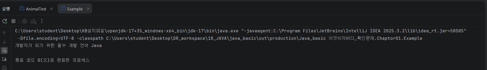

# 📝 이것이 자바다 확인문제 ch01

## 1. 자바 언어의 특징
**Q. 자바 언어의 특징을 잘못 설명한 것은 무엇입니까?**
- ➊ 안드로이드 애플리케이션뿐만 아니라 웹 사이트를 개발할 때 사용하는 언어이다.
- ➋ 한 번 작성으로 다양한 운영체제에서 실행할 수 있다.
- ➌ 객체 지향 프로그래밍 언어이다.
- **➍ 개발자가 코드로 메모리를 관리해야 한다.**

> **정답: ➍**
> **해설**: 자바는 **가비지 컬렉터(Garbage Collector)**가 자동으로 메모리를 관리해줌. 개발자가 직접 메모리를 해제할 필요가 없어 생산성이 높고 안전함.

---

## 2. JDK의 종류 (Open JDK vs Oracle JDK)
**Q. Open JDK와 Oracle JDK를 잘못 설명한 것은 무엇입니까?**
- ➊ 둘 다 학습용 및 개발용으로는 무료로 사용 가능하다.
- **➋ Oracle JDK는 개발 소스 공개 의무가 없지만, Open JDK는 있다.**
- ➌ 둘 다 Java SE의 구현체이다.
- ➍ JDK 11 LTS 버전의 후속 LTS 버전은 JDK 17이다.

---

## 3. 환경 변수
**Q. 환경 변수에 대해 잘못 설명한 것은 무엇입니까?**
- ➊ 프로그램에서 사용할 수 있도록 운영체제가 관리한다.
- ➋ JAVA_HOME은 JDK가 설치된 디렉토리 경로를 가지고 있다.
- ➌ PATH는 명령 프롬프트 또는 터미널에서 명령어 파일을 찾을 때 이용된다.
- **➍ 환경 변수를 수정하면 기존 명령 프롬프트 또는 터미널에서 바로 적용된다.**

> **정답: 4번**
> **해설**: 환경 변수를 변경하면 이미 열려 있는 터미널에는 적용되지 않음. 터미널을 종료하고 새로 열어야 변경된 설정이 반영됨.

---

## 4. 자바 가상 머신 (JVM)
**Q. 자바 가상 머신(JVM)에 대해 잘못 설명한 것은 무엇입니까?**
- ➊ JVM은 java.exe 명령어에 의해 구동된다.
- ➋ JVM은 바이트코드를 기계어로 변환하고 실행시킨다.
- **➌ JVM은 운영체제에 독립적이다(운영체제별로 동일한 JVM이 사용된다).**
- ➍ 바이트코드는 어떤 JVM에서도 실행 가능한 독립적 코드이다.

> **정답: 3번**
> **해설**: 자바 프로그램은 운영체제에 독립적이지만, **JVM 자체는 운영체제에 종속적**임. 윈도우용, 맥용, 리눅스용 JVM이 각각 다르게 설계되어 있음.

---

## 5. 자바 프로그램 개발 과정
**Q. 자바 프로그램 개발 과정을 순서대로 적어보세요.**
**( ➌ ) -> ( ➊ ) -> ( ➋ ) -> ( ➍ )**
- ➊ javac.exe로 바이트코드 파일(~.class )을 생성한다.
- ➋ java.exe로 JVM을 구동시킨다.
- ➌ 자바 소스 파일(~.java)을 작성한다.
- ➍ JVM은 main() 메소드를 찾아 메소드 블록을 실행시킨다.

---

## 6. 자바 소스 파일 작성 규칙
**Q. 자바 소스 파일을 작성할 때 잘못된 것은 무엇입니까?**
- ➊ 자바 소스 파일명과 클래스명은 대소문자가 동일해야 한다.
- ➋ 클래스 블록과 메소드 블록은 반드시 중괄호 { }로 감싸야 한다.
- ➌ 실행문 뒤에는 반드시 세미콜론(;)을 붙여야 한다.
- **➍ 주석은 문자열 안에도 작성할 수 있다.**

> **정답: 4번**
> **해설**: 큰따옴표(`" "`) 안의 주석 기호는 주석이 아니라 일반 문자열로 취급됨.

---

## 7. 이클립스(Eclipse) IDE
**Q. 이클립스의 특징을 올바르게 설명한 것을 모두 선택하세요.**
- [x] ➊ 오픈 소스 통합 개발 환경(IDE)이다.
- [x] ➋ 소스 파일을 저장하면 자동 컴파일되어 바이트코드 파일이 생성된다.
- [x] ➌ 워크스페이스(Workspace)는 프로젝트들이 생성되는 기본 디렉토리를 말한다.
- [x] ➍ Java 17을 지원하는 최소 버전은 Eclipse IDE 2021-12이다.

---

## 8. 실습 과제 (Example.java)
**출력 결과:** `개발자가 되기 위한 필수 개발 언어 Java`

```java
package ch01.verify;

public class Example {
    public static void main(String[] args) {
        System.out.println("개발자가 되기 위한 필수 개발 언어 Java");
    }
}
```
