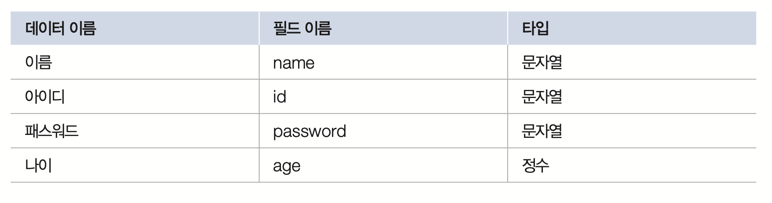
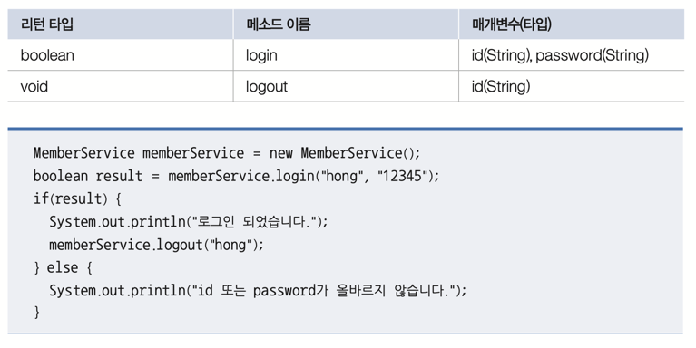
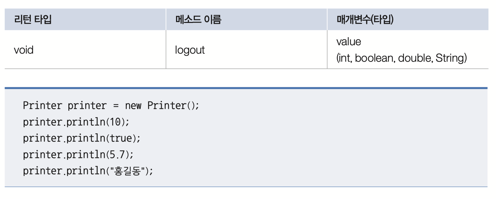
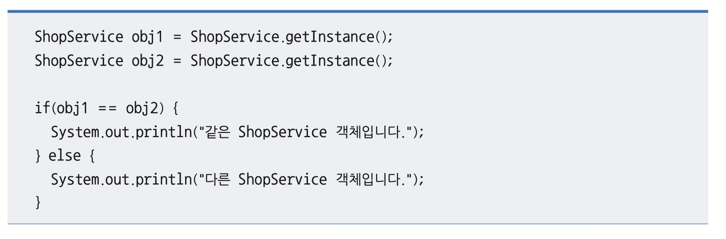

## 1. 객체와 클래스
**Q. 객체와 클래스에 대한 설명으로 틀린 것은 무엇입니까?**
- [ ] ➊ 클래스는 객체를 생성하기 위한 설계도(청사진)와 같은 것이다.
- [ ] ➋ new 연산자로 클래스의 생성자를 호출함으로써 객체가 생성된다.
- [x] ➌ 하나의 클래스로 하나의 객체만 생성할 수 있다.
- [ ] ➍ 객체는 클래스의 인스턴스이다.

* **정답: ➌**
* **해설**: 클래스는 객체를 만들기 위한 틀(설계도)일 뿐이며, `new` 연산자를 사용하여 하나의 클래스로부터 메모리에 서로 다른 값을 가진 여러 개의 객체(인스턴스)를 얼마든지 생성할 수 있다.

## 2. 클래스의 구성 멤버
**Q. 클래스의 구성 멤버가 아닌 것은 무엇입니까?**
- [ ] ➊ 필드(field)
- [ ] ➋ 생성자(constructor)
- [ ] ➌ 메소드(method)
- [x] ➍ 로컬 변수(local variable)

*  **정답: ➍**
* **해설**: 클래스의 구성 멤버는 필드, 생성자, 메소드 세 가지다! 
* 로컬 변수는 메소드나 생성자 내부에서 선언된 변수로, 실행 블록이 끝나면 소멸하며 클래스의 구성 멤버에 포함되지 X 

## 3. 필드, 생성자, 메소드 
**Q. 필드, 생성자, 매소드에 대한 설명으로 틀린 것은? 
,
## 4. 필드에 대한 설명
**Q. 필드에 대한 설명으로 틀린 것은 무엇입니까?**
- [ ] ➊ 필드는 메소드에서 사용할 수 있다.
- [ ] ➋ 인스턴스 필드 초기화는 생성자에서 할 수 있다.
- [x] ➌ 필드는 반드시 생성자 선언 전에 선언되어야 한다.
- [ ] ➍ 필드는 초기값을 주지 않더라도 기본값으로 자동 초기화된다.

*  **정답: ➌**
* **해설**: 자바에서 필드 선언 위치는 클래스 내부라면 생성자 선언 전후 어디든 상관없다. 일반적으로 가독성을 위해 필드를 클래스 상단에 모아서 선언하는 관례가 있을 뿐, 문법적으로 필드가 반드시 생성자보다 먼저 선언되어야 하는 것은 아니다.

## 5. 생성자에 대한 설명
**Q. 생성자에 대한 설명으로 틀린 것은 무엇입니까?**
- [x] ➊ 객체를 생성하려면 생성자 호출이 반드시 필요한 것은 아니다.
- [ ] ➋ 생성자는 다른 생성자를 호출하기 위해 this()를 사용할 수 있다.
- [ ] ➌ 생성자가 선언되지 않으면 컴파일러가 기본 생성자를 추가한다.
- [ ] ➍ 외부에서 객체를 생성할 수 없도록 생성자에 private 접근 제한자를 붙일 수 있다.

* **정답: ➊**
* **해설**: 모든 객체는 생성자를 호출해야만 생성될 수 있다. 클래스 내부에 명시적으로 선언된 생성자가 없더라도 컴파일러가 자동으로 기본 생성자를 추가해주기 때문에, 객체를 생성할 때는 항상 생성자가 호출된다.

## 6. 메소드에 대한 설명
**Q. 메소드에 대한 설명으로 틀린 것은 무엇입니까?**
- [ ] ➊ 리턴값이 없는 메소드는 리턴 타입을 `void`로 해야 한다.
- [ ] ➋ 리턴 타입이 있는 메소드는 리턴값을 지정하기 위해 반드시 `return` 문이 있어야 한다.
- [ ] ➌ 매개값의 수를 모를 경우 “…”를 이용해서 매개변수를 선언할 수 있다.
- [x] ➍ 메소드의 이름은 중복해서 선언할 수 없다.

* **정답: ➍**
* **해설**: 자바에서는 **메소드 오버로딩(Method Overloading)** 기능을 제공하므로, 매개변수의 타입, 개수, 또는 순서가 다를 경우 동일한 이름의 메소드를 클래스 내에 여러 개 선언할 수 있다. 따라서 메소드 이름이 중복될 수 없다는 것은 틀린 설명이다.

## 7. 메소드 오버로딩
**Q. 메소드 오버로딩에 대한 설명으로 틀린 것은 무엇입니까?**
- [ ] ➊ 동일한 이름의 메소드를 여러 개 선언하는 것을 말한다.
- [x] ➋ 반드시 리턴 타입이 달라야 한다.
- [ ] ➌ 매개변수의 타입, 수, 순서를 다르게 선언해야 한다.
- [ ] ➍ 매개값의 타입 및 수에 따라 호출될 메소드가 선택된다.

*  **정답: ➋**
* **해설**: 메소드 오버로딩은 메소드의 이름은 같지만 매개변수(타입, 개수, 순서)가 다를 때 성립한다. 리턴 타입은 오버로딩의 성립 조건과 무관하며, 리턴 타입만 다르게 선언하는 것은 오버로딩으로 인정되지 않는다.

## 8. 인스턴스 멤버와 정적 멤버
**Q. 인스턴스 멤버와 정적 멤버에 대한 설명으로 틀린 것은 무엇입니까?**
- [ ] ➊ 정적 멤버는 static으로 선언된 필드와 메소드를 말한다.
- [x] ➋ 인스턴스 필드는 생성자 및 정적 블록에서 초기화될 수 있다.
- [ ] ➌ 정적 필드와 정적 메소드는 객체 생성 없이 클래스를 통해 접근할 수 있다.
- [ ] ➍ 인스턴스 필드와 메소드는 객체를 생성하고 사용해야 한다.

* **정답: ➋**
* **해설**: 인스턴스 필드는 객체가 생성될 때마다 메모리에 할당되므로, 객체 생성 이후에 호출되는 생성자를 통해 초기화해야 한다. 
> 반면, 정적 블록은 객체 생성과 상관없이 클래스가 로딩될 때 실행되므로, 여기서 인스턴스 필드를 초기화하는 것은 불가능하다.

## 9. final 필드와 상수
**Q. final 필드와 상수(static final)에 대한 설명으로 틀린 것은 무엇입니까?**
- [ ] ➊ final 필드와 상수는 초기값이 저장되면 값을 변경할 수 없다.
- [x] ➋ final 필드와 상수는 생성자에서 초기화될 수 있다.
- [ ] ➌ 상수의 이름은 대문자로 작성하는 것이 관례이다.
- [ ] ➍ 상수는 객체 생성 없이 클래스를 통해 사용할 수 있다.

* **정답: ➋**
* **해설**: `final` 필드는 생성자에서 초기화할 수 있지만, `static final`로 선언된 상수는 객체 생성과 무관하게 클래스가 로딩될 때 메모리에 올라가므로 생성자에서 초기화할 수 없다. 상수는 선언 시점에 바로 값을 대입하거나, `static` 블록을 통해서만 초기화해야 한다.


## 10. 패키지 (Package)
**Q. 패키지에 대한 설명으로 틀린 것은 무엇입니까?**
- [ ] ➊ 패키지는 클래스들을 그룹화시키는 기능을 한다.
- [ ] ➋ 클래스가 패키지에 소속되려면 패키지 선언을 반드시 해야 한다.
- [ ] ➌ import 문은 다른 패키지의 클래스를 사용할 때 필요하다.
- [x] ➍ com.mycom 패키지에 소속된 클래스는 com.yourcom에 옮겨 놓아도 동작한다.

**정답: ➍**

**해설**
> 자바에서 클래스의 풀 네임(Fully Qualified Name)에는 패키지 정보가 포함된다.
> 클래스 파일 내부의 `package com.mycom;` 선언과 실제 파일이 위치한 디렉토리 구조가 일치해야 하므로, 물리적인 위치만 `com.yourcom`으로 옮긴다고 해서
> 정상적으로 동작하지 않는다. 패키지를 변경하려면 소스 코드 내의 `package` 선언문도 함께 수정해야 합니다.

## 11. 접근 제한자 (Access Modifier)
**Q. 접근 제한에 대한 설명으로 틀린 것은 무엇입니까?**
- [ ] ➊ 접근 제한자는 클래스, 필드, 생성자, 메소드의 사용을 제한한다.
- [ ] ➋ public 접근 제한은 아무런 제한 없이 해당 요소를 사용할 수 있게 한다.
- [x] ➌ default 접근 제한은 해당 클래스 내부에서만 사용을 허가한다.
- [ ] ➍ 외부에서 접근하지 못하도록 하려면 private 접근 제한을 해야 한다.

**정답: ➌**
**해설**
>`default` 접근 제한(접근 제한자를 명시하지 않은 경우)은 해당 클래스 내부뿐만 아니라, **동일한 패키지**에 속한 모든 클래스에서 접근이 가능하다. 클래스 내부에서만 사용을 허가하는 것은 `private` 접근 제한이다.


## 12. 클래스 구성 멤버 식별
**Q. 다음 클래스에서 해당 멤버가 필드, 생성자, 메소드 중 어떤 것인지 ( ) 안에 적어보세요.**
```java
public class Member {
    private String name;             // ( 필드 )
    public Member(String name) { … } // ( 생성자 )
    public void setName(String name) { … } // ( 메소드 )
}
``` 
**해설**
>
>필드(Field): 객체의 데이터를 저장하는 변수이다. 클래스 블록 내부에서 선언된다.
>
>생성자(Constructor): new 연산자로 객체를 생성할 때 호출되며, 객체의 초기화를 담당한다. 클래스 이름과 동일한 이름을 가지며 리턴 타입이 없다.
>
> 메소드(Method): 객체의 동작에 해당하는 실행 블록이다. 리턴 타입(위 예시에서는 void)이 반드시 명시되어야 한다.

## 13. Member 클래스 선언
**Q. 회원의 데이터(이름, 아이디, 패스워드, 나이)를 가지는 Member 클래스를 선언해보세요.**

```java
public class Member {
    String name;
    String id;
    String password;
    int age;
}
```
**해설**
> 이름, 아이디, 패스워드는 문자열 데이터이므로 String 타입을 사용하고, 나이는 숫자 데이터이므로 int 타입을 사용한다. 클래스 내부에 선언된 이 변수들은 객체의 상태를 저장하는 **필드(Field)**가 된다.

## 14. Member 클래스 생성자 선언
**Q. name 필드와 id 필드를 외부에서 받은 값으로 초기화하도록 생성자를 선언해보세요.**


[예제코드]
```
Member user1 = new Member("홍길동", "hong");
``` 
[정답]
```java
public class Member {
    String name;
    String id;
    String password;
    int age;

    // 생성자 추가
    public Member(String name, String id) {
        this.name = name;
        this.id = id;
    }
}
## 15. MemberService 클래스와 메소드 선언
**Q. 다음 조건과 예제 코드를 보고 login(), logout() 메소드를 선언해보세요.**
```java
public class MemberService {
    
    // login 메소드 선언
    public boolean login(String id, String password) {
        if (id.equals("hong") && password.equals("12345")) {
            return true;
        } else {
            return false;
        }
    }

    // logout 메소드 선언
    public void logout(String id) {
        System.out.println(id + "님이 로그아웃 되었습니다");
    }
}
```
## 15. MemberService 클래스와 메소드 선언
**Q. 다음 조건과 예제 코드를 보고 login(), logout() 메소드를 선언해보세요.**



```java
public class MemberService {
    
    // login 메소드 선언
    public boolean login(String id, String password) {
        if (id.equals("hong") && password.equals("12345")) {
            return true;
        } else {
            return false;
        }
    }

    // logout 메소드 선언
    public void logout(String id) {
        System.out.println(id + "님이 로그아웃 되었습니다");
    }
}
 ```
해설

> * login() 메소드: 리턴 타입은 boolean이며, 매개변수로 id와 password를 받는다. 문자열 비교 시에는 == 연산자가 아닌 .equals() 메소드를 사용해야 정확한 비교가 가능하다. 조건이 맞으면 true, 틀리면 false를 리턴한다.
> * logout() 메소드: 리턴값이 없으므로 리턴 타입을 void로 지정한다. 매개변수로 받은 id와 문자열을 결합하여 출력문을 작성한다.

## 16. Printer 클래스 메소드 오버로딩
**Q. println() 메소드의 매개값으로 int, boolean, double, String 타입을 받을 수 있도록 Printer 클래스에서 메소드를 오버로딩하여 선언해보세요.**


```java
public class Printer {
    
    // int 타입을 매개값으로 받는 println 메소드
    public void println(int value) {
        System.out.println(value);
    }

    // boolean 타입을 매개값으로 받는 println 메소드
    public void println(boolean value) {
        System.out.println(value);
    }

    // double 타입을 매개값으로 받는 println 메소드
    public void println(double value) {
        System.out.println(value);
    }

    // String 타입을 매개값으로 받는 println 메소드
    public void println(String value) {
        System.out.println(value);
    }
}

``` 
해설

> 메소드 오버로딩(Overloading): 클래스 내에 같은 이름의 메소드를 여러 개 선언하는 것이다. 단, 매개변수의 타입, 개수, 순서 중 하나는 반드시 달라야 한다.
> 위 코드에서는 println이라는 동일한 이름을 사용하지만, 매개변수의 타입을 각각 int, boolean, double, String으로 다르게 선언하여 오버로딩을 구현한다.
> 리턴값이 없이 출력만 수행하므로 리턴 타입은 모두 void로 지정한다.

## 18. 싱글톤(Singleton) 패턴 적용
**Q. 싱글톤 패턴을 사용하여 obj1과 obj2가 동일한 객체를 참조하도록 ShopService 클래스를 작성해보세요.**


```java
public class ShopService {
    // 1. 자신의 타입으로 정적 필드 선언 및 객체 생성
    private static ShopService singleton = new ShopService();

    // 2. 외부에서 new 연산자로 생성자를 호출할 수 없도록 private 제한
    private ShopService() {}

    // 3. 외부에서 객체를 얻을 수 있는 정적 메소드 선언
    public static ShopService getInstance() {
        return singleton;
    }
}
```
해설

* 싱글톤 패턴이란?: 애플리케이션 전체에서 단 하나의 객체만 생성되도록 보장하는 디자인 패턴이다.

> 구현 방법:
클래스 내부에서 스스로의 인스턴스를 static 필드로 생성하고 private으로 감싸 외부 접근을 막는다.
>
>생성자를 private으로 선언하여 외부에서 new 연산자로 새로운 객체를 만들지 못하게 한다.
>
>getInstance()라는 정적 메소드를 통해 처음에 만들어둔 단 하나의 객체(singleton)만 리턴한다.
>
> 이렇게 하면 obj1과 obj2는 모두 메모리상의 동일한 주소를 가진 객체를 참조하게 되므로 obj1 == obj2 결과가 true가 된다.

---

## 19. Setter와 Getter를 이용한 데이터 보호
**Q. 잔고(balance) 필드가 0에서 1,000,000 사이의 값만 가질 수 있도록 Account 클래스를 작성해보세요.**

[예제코드]
```java
Account account = new Account();
account.setBalance(10000);
System.out.println("현재 잔고: " + account.getBalance()); //현재 잔고: 10000
        account.setBalance(-100);
System.out.println("현재 잔고: " + account.getBalance()); //현재 잔고: 10000
        account.setBalance(2000000);
System.out.println("현재 잔고: " + account.getBalance()); //현재 잔고: 10000
        account.setBalance(300000);
System.out.println("현재 잔고: " + account.getBalance()); //현재 잔고: 300000
```
[정답]
```java
public class Account {
    // 1. 상수 선언
    public static final int MIN_BALANCE = 0;
    public static final int MAX_BALANCE = 1000000;

    // 2. 필드 선언 (외부 접근을 막기 위해 private)
    private int balance;

    // 3. Getter 선언
    public int getBalance() {
        return balance;
    }

    // 4. Setter 선언
    public void setBalance(int balance) {
        // 매개값이 0보다 작거나 백만 원을 초과하면 현재 balance 유지
        if (balance >= MIN_BALANCE && balance <= MAX_BALANCE) {
            this.balance = balance;
        }
        // 조건을 만족하지 않으면 아무런 처리도 하지 않음 (기존 값 유지)
    }
}
```
---

## 20. 종합 실습: 은행 관리 프로그램

**Q. 다음은 키보드로부터 계좌 정보를 입력받아 계좌를 관리하는 프로그램입니다. 계좌는 Account 객체로 생성되고 BankApplication에서 길이 100인 Account[ ] 배열로 관리됩니다. 실행 결과를 보고, Account와 BankApplication 클래스를 작성해보세요(키보드로 입력받을 때는 Scanner 의 nextLine () 메소드를 사용).**

[Account.java](Account.java)

[BankApplication.java](BankApplication.java)

### 1) Account 클래스 (계좌 정보 모델)

### **주요 특징**
*   **필드 캡슐화**: 모든 필드(`ano`, `owner`, `balance`)를 `private`으로 선언하여 외부의 직접적인 접근을 막고 데이터를 보호한다.
*   **생성자**: 객체 생성 시점에 계좌번호, 예금주, 초기 잔액을 한 번에 설정한다.
*   **Getter/Setter**: 외부에서 안전하게 필드 값을 읽거나 수정할 수 있도록 통로를 제공한다.

### **핵심 코드**
```java
public class Account {
    private String ano;    // 계좌번호
    private String owner;  // 계좌주
    private int balance;   // 잔고

    public Account(String ano, String owner, int balance) {
        this.ano = ano;
        this.owner = owner;
        this.balance = balance;
    }
    // Getter, Setter 생략...
}
```

### 2) Account 클래스 (계좌 정보 모델)
프로그램의 전체적인 흐름을 제어하는 **컨트롤러(Controller)** 역할

### **주요 특징** 
**1. 실행 구조와 필드**
*   **`accountArray`**: 생성된 계좌 객체들을 저장하기 위한 `Account[100]` 배열이다. 최대 100개의 계좌를 관리할 수 있다.
*   **`Scanner`**: 사용자로부터 메뉴 선택 및 계좌 정보를 입력받기 위해 `nextLine()` 메소드를 주로 사용한다. `nextInt()` 대신 `Integer.parseInt(scanner.nextLine())`을 사용하여 입력 버퍼 문제를 방지한다.

**2. 핵심 기능(메소드) 설명**
*   **`createAccount()`**: 사용자에게 계좌번호, 계좌주, 초기 금액을 입력받아 `new Account(...)`로 객체를 생성한 후, 배열의 빈 칸(`null`)에 저장한다.
*   **`accountList()`**: 배열을 순회하며 `null`이 아닌 칸에 담긴 계좌 정보를 모두 출력한다.
*   **`deposit()` / `withdraw()`**: 입력받은 계좌번호로 객체를 찾아 잔액을 수정한다. 이때 객체의 `Setter`를 통해 데이터를 업데이트한다.
*   **`findAccount(String ano)`**: 가장 중요한 **보조 메소드**이다. 입력된 계좌번호와 배열 내 객체들의 계좌번호를 하나씩 비교하여 일치하는 객체를 찾아 반환한다.

 **3. 프로그래밍 테크닉**
*   **무한 루프(`while`)**: 사용자가 '5.종료'를 선택하기 전까지 메뉴를 계속해서 보여주고 입력을 기다린다.
*   **참조 타입 비교**: 계좌번호 비교 시 `==`이 아닌 `equals()`를 사용하여 실제 문자열 값이 같은지 확인한다.
*   **객체 배열 순회**: 배열의 크기는 100이지만 실제 담긴 객체는 그보다 적을 수 있으므로, 항상 `if(accountArray[i] != null)` 체크를 통해 `NullPointerException`을 방지한다.

### **📌 주요 로직 흐름**
```java
// 1. 계좌 찾기 로직 (재사용성 높음)
private static Account findAccount(String ano) {
    for(int i=0; i<accountArray.length; i++) {
        // 배열 요소가 null이 아니고, 계좌번호가 일치하는지 확인
        if(accountArray[i] != null && accountArray[i].getAno().equals(ano)) {
            return accountArray[i]; // 찾으면 해당 객체 리턴
        }
    }
    return null; // 못 찾으면 null 리턴
}

// 2. 예금 시 잔액 업데이트 로직
Account account = findAccount(ano); // 계좌 찾기
if(account != null) {
    // 기존 잔고를 가져와서 입력받은 금액을 더한 후 다시 저장
    account.setBalance(account.getBalance() + money);
}
```
