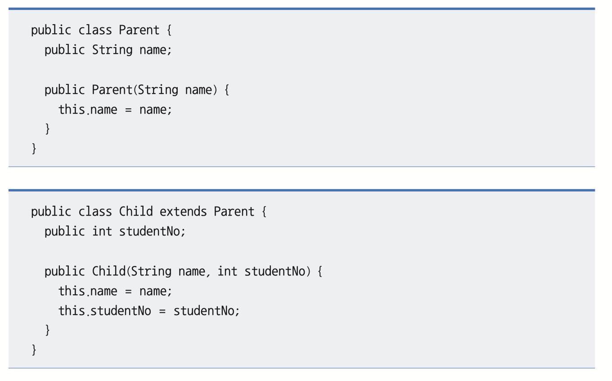
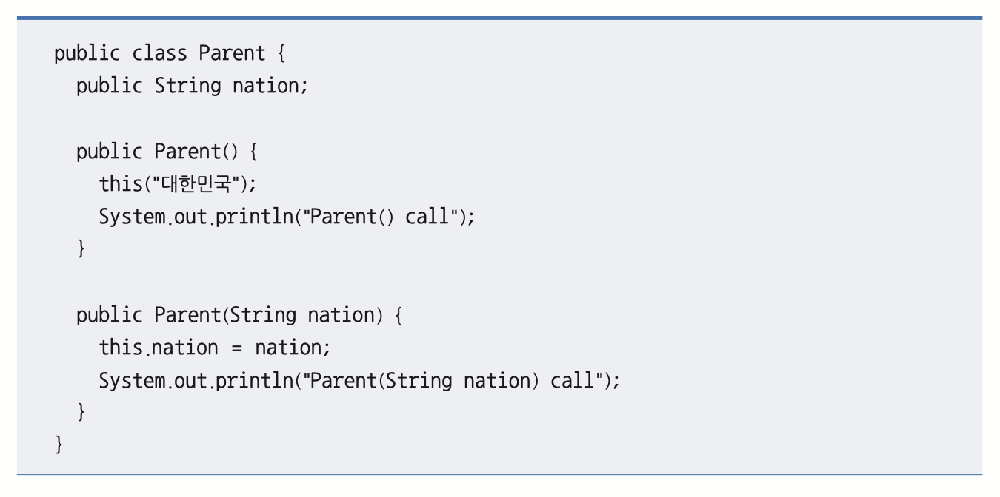
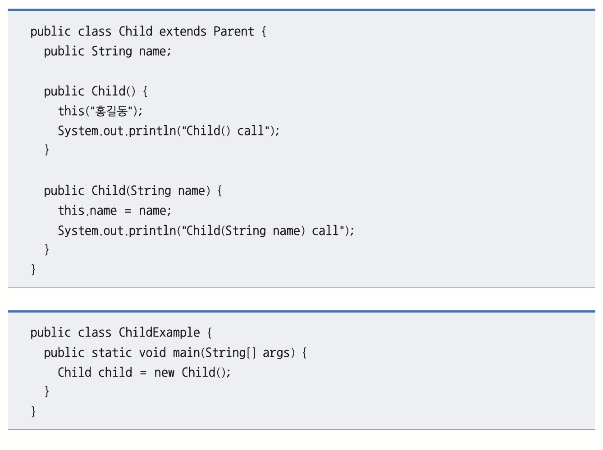
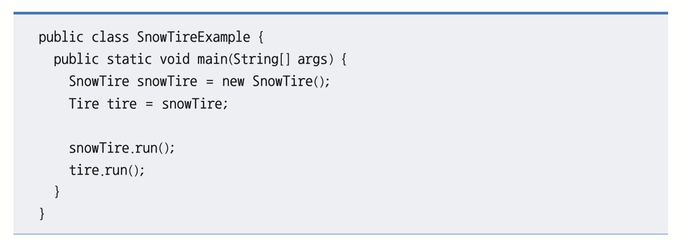
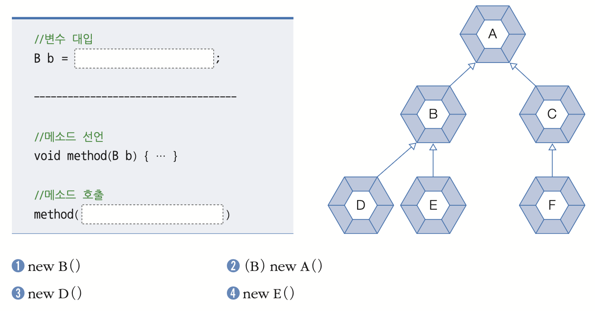
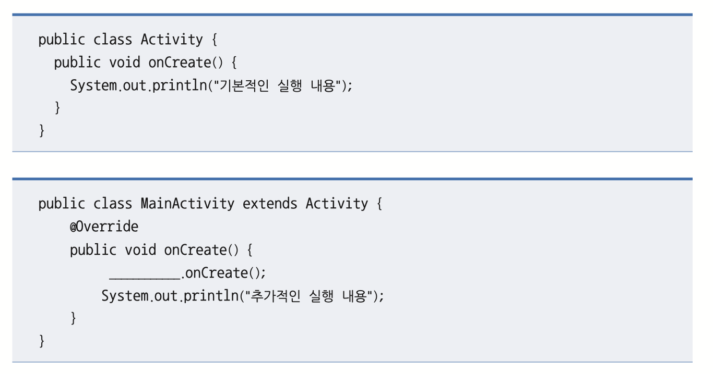
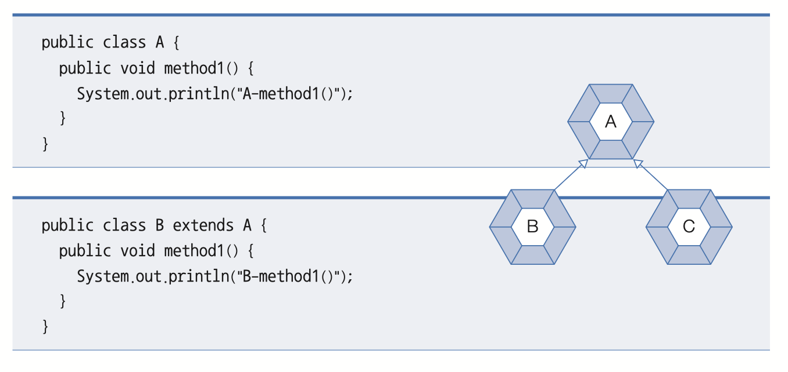
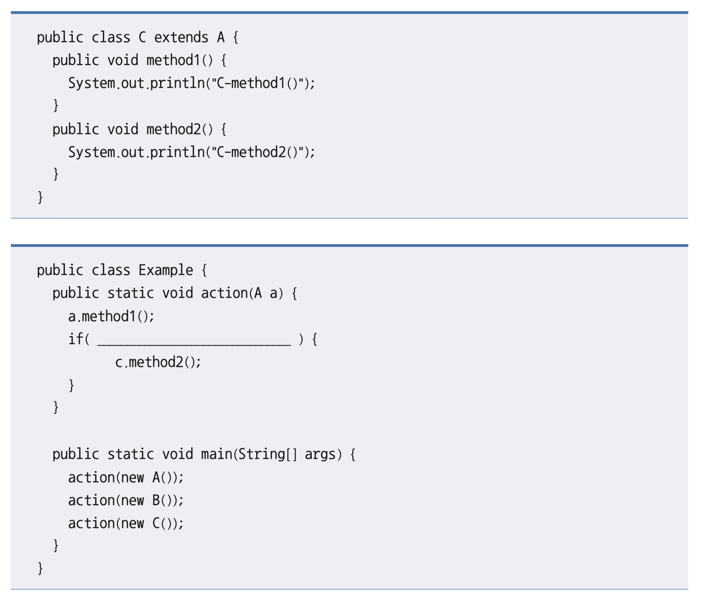

# 📝 이것이 자바다 확인문제 - CH07

---

## 01. 자바의 상속 (Inheritance)

### Q. 자바의 상속에 대한 설명 중 틀린 것은 무엇입니까?

- [x] ➊ 자바는 다중 상속을 허용한다.
- [ ] ➋ 부모의 메소드를 자식 클래스에서 재정의(오버라이딩)할 수 있다.
- [ ] ➌ 부모의 `private` 접근 제한을 가진 필드와 메소드는 상속 대상이 아니다.
- [ ] ➍ `final` 클래스는 상속할 수 없고, `final` 메소드는 오버라이딩할 수 없다.

> **정답 : ➊**
>
> **해설 :**  
> 자바는 클래스 간의 다중 상속을 허용하지 않는다.
>
> 다중 상속 시 발생할 수 있는 다이아몬드 문제를 방지하기 위함이다.
>
> 대신 인터페이스를 통해 다중 구현을 지원한다.

---

## 02. 클래스 타입 변환 (Type Conversion)

### Q. 클래스 타입 변환에 대한 설명 중 틀린 것은 무엇입니까?

- [ ] ➊ 자식 객체는 부모 타입으로 자동 타입 변환된다.
- [x] ➋ 부모 객체는 어떤 자식 타입으로도 강제 타입 변환된다.
- [ ] ➌ 자동 타입 변환을 이용하여 다형성을 구현한다.
- [ ] ➍ 강제 타입 변환 전 `instanceof` 연산자로 검사하는 것이 좋다.

> **정답 : ➋**
>
> **해설 :**  
> 부모 객체가 무조건 자식 타입으로 변환되는 것은 아니다.
>
> 원래 자식 객체였던 경우에만 다시 자식 타입으로 강제 변환할 수 있다.

---

## 03. final 키워드

### Q. final 키워드에 대한 설명으로 틀린 것은 무엇입니까?

- [x] ➊ final 클래스는 부모 클래스로 사용할 수 있다.
- [ ] ➋ final 필드는 초기화 후 변경할 수 없다.
- [ ] ➌ final 메소드는 오버라이딩할 수 없다.
- [ ] ➍ static final 필드는 상수를 의미한다.

> **정답 : ➊**
>
> **해설 :**  
> `final` 클래스는 더 이상 상속할 수 없는 최종 클래스이다.
>
> 따라서 부모 클래스가 될 수 없다.

| 대상 | 효과 |
| :--- | :--- |
| 클래스 | 상속 불가 |
| 메소드 | 오버라이딩 불가 |
| 필드 | 값 변경 불가 |

---

## 04. 메소드 오버라이딩 (Method Overriding)

### Q. 오버라이딩에 대한 설명으로 틀린 것은 무엇입니까?

- [ ] ➊ 부모 메소드의 시그너처와 동일해야 한다.
- [ ] ➋ 부모 메소드보다 더 좁은 접근 제한자를 사용할 수 없다.
- [ ] ➌ `@Override`를 사용하면 컴파일러가 검증한다.
- [x] ➍ protected 메소드는 다른 패키지 자식 클래스에서 재정의할 수 없다.

> **정답 : ➍**
>
> **해설 :**  
> `protected` 접근 제한자는 같은 패키지뿐 아니라  
> 다른 패키지의 자식 클래스에서도 접근 가능하다.
>
> 따라서 오버라이딩도 가능하다.

---

## 05. 추상 클래스 (Abstract Class)

### Q. 추상 클래스에 대한 설명으로 틀린 것은 무엇입니까?

- [ ] ➊ 직접 객체 생성은 불가능하며 상속만 가능하다.
- [x] ➋ 추상 메소드를 반드시 가져야 한다.
- [ ] ➌ 추상 메소드는 자식 클래스에서 오버라이딩할 수 있다.
- [ ] ➍ 추상 메소드를 재정의하지 않으면 자식도 추상 클래스가 되어야 한다.

> **정답 : ➋**
>
> **해설 :**  
> 추상 클래스는 추상 메소드가 없어도 선언 가능하다.
>
> 하지만 추상 메소드가 하나라도 존재하면 반드시 추상 클래스여야 한다.

---

## 06. 부모 생성자 호출 에러 해결

### Q. Child 생성자에서 컴파일 에러가 발생한 이유와 해결 방법을 설명하세요.



### ❌ 에러 발생 이유

> 자식 객체 생성 시 부모 객체가 먼저 생성되어야 한다.
>
> 컴파일러는 자식 생성자의 첫 줄에 자동으로 `super();`를 추가한다.
>
> 하지만 부모 클래스에 기본 생성자가 존재하지 않아 에러가 발생한다.

### ✅ 해결 방법

```java
public class Child extends Parent {

    public int studentNo;

    public Child(String name, int studentNo) {

        super(name);

        this.name = name;
        this.studentNo = studentNo;
    }
}
```

> **해설 :**  
> `super(name);`을 사용하여 부모의 생성자를 직접 호출해야 한다.

---

## 07. 생성자 호출 순서와 실행 결과

### Q. ChildExample 실행 결과를 작성하세요.




### 출력 결과

```text
Parent(String nation) call
Parent() call
Child(String name) call
Child() call
```

> **해설 :**  
> 자식 객체 생성 시 부모 생성자가 먼저 실행된다.
>
> `this()`와 `super()` 호출 순서를 따라가면  
> 부모 → 자식 순서로 생성자가 실행되는 것을 확인할 수 있다.

---

## 08. 다형성과 메소드 오버라이딩

### Q. SnowTireExample 실행 결과를 작성하세요.




### 출력 결과

```text
스노우 타이어가 굴러갑니다.
스노우 타이어가 굴러갑니다.
```

> **해설 :**  
> 부모 타입으로 자동 타입 변환되더라도,
>
> 오버라이딩된 메소드는 실제 객체 기준으로 실행된다.
>
> 따라서 `tire.run()` 역시 `SnowTire`의 메소드가 호출된다.

---

## 09. 자동 타입 변환과 상속 관계

### Q. 상속 관계를 보고 빈칸에 들어올 수 없는 코드를 선택하세요.



- [ ] ➊ new B()
- [x] ➋ (B) new A()
- [ ] ➌ new D()
- [ ] ➍ new E()

> **정답 : ➋**
>
> **해설 :**  
> 부모 객체를 자식 타입으로 강제 변환할 수는 없다.
>
> 강제 타입 변환은 원래 자식 객체였던 경우에만 가능하다.

---

## 10. 추상 메소드와 재정의 의무

### Q. 다음 코드에서 컴파일 에러가 발생한 이유를 설명하세요.

```java
public abstract class Machine {

    public void powerOn() { }

    public void powerOff() { }

    public abstract void work();
}

public class Computer extends Machine {
}
```

### ❌ 에러 발생 이유

> `Machine` 클래스에는 추상 메소드 `work()`가 존재한다.
>
> 이를 상속받은 `Computer` 클래스는 반드시 `work()`를 재정의해야 한다.
>
> 현재 구현하지 않았기 때문에 컴파일 에러가 발생한다.

### ✅ 해결 방법

```java
public class Computer extends Machine {

    @Override
    public void work() {
        System.out.println("컴퓨터가 작업을 수행합니다.");
    }
}
```

---

## 11. super 키워드를 이용한 부모 메소드 호출

### Q. MainActivity의 onCreate() 실행 시 부모 메소드도 실행되도록 코드를 작성하세요.



### 정답

```java
super
```

> **해설 :**  
> `super`는 부모 객체를 참조한다.
>
> `super.onCreate()`를 호출하면 부모 메소드 내용을 먼저 실행할 수 있다.

---

## 12. instanceof 연산자와 강제 타입 변환

### Q. 매개값이 C 객체일 때만 `method2()`가 실행되도록 코드를 작성하세요.




### 정답

```java
a instanceof C c
```

> **해설 :**  
> `instanceof`는 객체 타입을 검사하는 연산자이다.
>
> Java 12 이상의 패턴 매칭 문법을 사용하면  
> 타입 검사와 형변환을 동시에 수행할 수 있다.